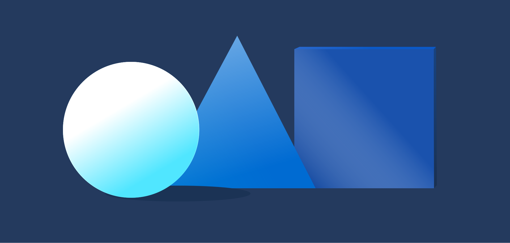

# Design basics for UWP apps

The Universal Windows Platform (UWP) design guidance is a resource to help you design and build beautiful, polished apps. It's not a list of prescriptive rules - it's a living document, designed to adapt to our evolving Fluent Design System as well as the needs of our app-building community. 

<!-- This introduction provides an overview of the Fluent Design System, UWP app design basics, and the XAML platform, helping you build user interfaces (UI) that scale beautifully across a range of devices. -->

## Overview

[**Introduction to UWP app design**](design-and-ui-intro.md)

An introduction to UWP features combined with best practices for creating apps that scale beautifully on all types of Windows-powered devices.

[**Fluent Design System**](../fluent-design-system/index.md)

The Fluent Design System presents our goals and principles for creating adaptive, empathetic, and beautiful user interfaces.

## Basics

[**Navigation basics**](navigation-basics.md)

Navigation in UWP apps is based on a flexible model of navigation structures, navigation elements, and system-level features. This article introduces you to these components and shows you how to use them together to create a good navigation experience.

[**Command basics**](commanding-basics.md)

Command elements are the interactive UI elements that enable the user to perform actions, such as sending an email, deleting an item, or submitting a form. This article describes the command elements, such as buttons and check boxes, the interactions they support, and the command surfaces (such as command bars and context menus) for hosting them.

[**Content basics**](content-basics.md)

The main purpose of any app is to provide access to content: in a photo-editing app, the photo is the content; in a travel app, maps and info about travel destinations is the content; and so on. This article provides content design recommendations for the three content scenarios: consumption, creation, and interaction.

## Tutorials

Learn how to create a basic photo-editing application in XAML and C#.
<!--  -->

[**1. Create a basic UI**](xaml-basics-ui.md)

Use XAML to create a basic user interface.

[**2. Create an adaptive layout**](xaml-basics-adaptive-layout.md)

Give the photo-editing application an adaptive layout.

[**3. Create custom styles**](xaml-basics-style.md)

Give our UWP controls your own look and feel by creating custom styles.