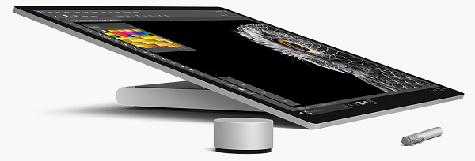
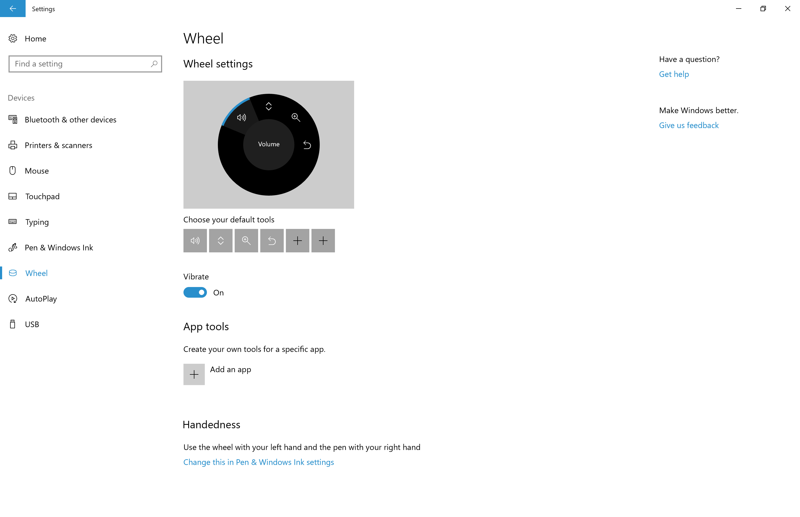
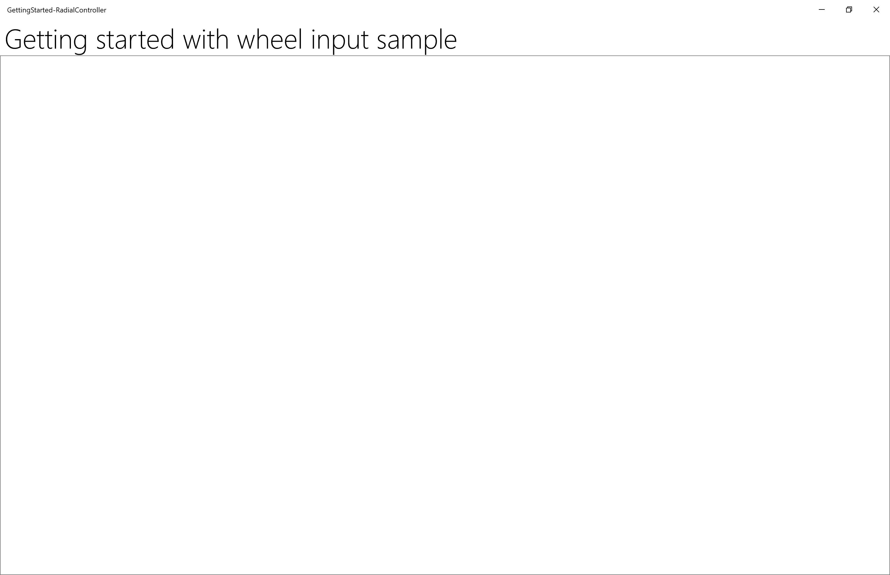
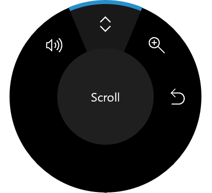
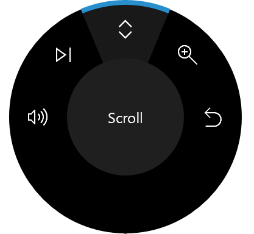
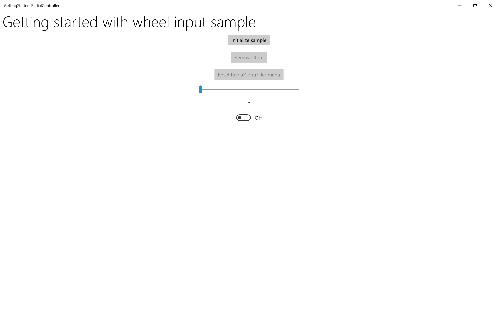
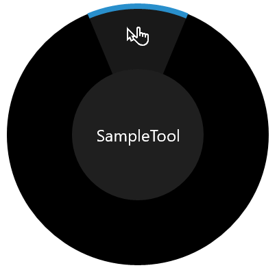
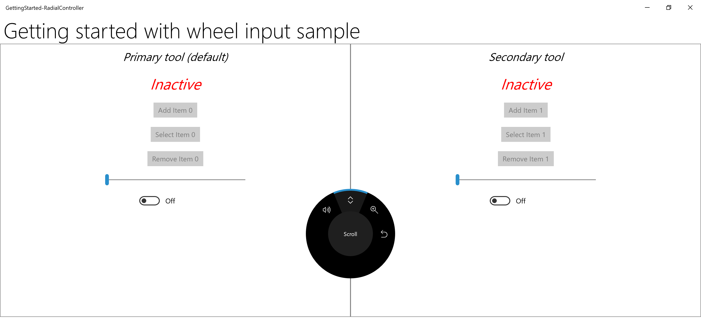

# Tutorial: Support the Surface Dial (and other wheel devices) in your UWP app

  
*Surface Dial with Surface Studio and Surface Pen* (available for purchase at the [Microsoft Store](https://aka.ms/purchasesurfacedial)).

This tutorial steps through how to customize the user interaction experiences supported by wheel devices such as the Surface Dial. We use snippets from a sample app, which you can download from GitHub (see [Sample code](#sample-code)), to demonstrate the various features and associated [**RadialController**](https://docs.microsoft.com/uwp/api/windows.ui.input.radialcontroller) APIs discussed in each step.

We focus on the following:
* Specifying which built-in tools are displayed on the [**RadialController**](https://docs.microsoft.com/uwp/api/windows.ui.input.radialcontroller) menu
* Adding a custom tool to the menu
* Controlling haptic feedback
* Customizing click interactions
* Customizing rotation interactions

For more about implementing these and other features, see [Surface Dial interactions in UWP apps](windows-wheel-interactions.md).

## Introduction

The Surface Dial is a secondary input device that helps users to be more productive when used together with a primary input device such as pen, touch, or mouse. As a secondary input device, the Dial is typically used with the non-dominant hand to provide access both to system commands and to other, more contextual, tools and functionality. 

The Dial supports three basic gestures: 
- Press and hold to display the built-in menu of commands.
- Rotate to highlight a menu item (if the menu is active) or to modify the current action in the app (if the menu is not active).
- Click to select the highlighted menu item (if the menu is active) or to invoke a command in the app (if the menu is not active).

## Prerequisites

* A computer (or a virtual machine) running Windows 10 Creators Update, or newer
* [Visual Studio 2017 (10.0.15063.0)](https://developer.microsoft.com/windows/downloads)
* [Windows 10 SDK (10.0.15063.0)](https://developer.microsoft.com/windows/downloads/windows-10-sdk)
* A wheel device (only the [Surface Dial](https://aka.ms/purchasesurfacedial) at this time)
* If you're new to Universal Windows Platform (UWP) app development with Visual Studio, have a look through these topics before you start this tutorial:  
    * [Get set up](https://docs.microsoft.com/windows/uwp/get-started/get-set-up)
    * [Create a "Hello, world" app (XAML)](https://docs.microsoft.com/windows/uwp/get-started/create-a-hello-world-app-xaml-universal)

## Set up your devices

1. Make sure your Windows device is on.
2. Go to **Start**, select **Settings** > **Devices** > **Bluetooth & other devices**, and then turn **Bluetooth** on.
3. Remove the bottom of the Surface Dial to open the battery compartment, and make sure that there are two AAA batteries inside.
4. If the battery tab is present on the underside of the Dial, remove it.
5. Press and hold the small, inset button next to the batteries until the Bluetooth light flashes.
6. Go back to your Windows device and select **Add Bluetooth or other device**.
7. In the **Add a device** dialog, select **Bluetooth** > **Surface Dial**. Your Surface Dial should now connect and be added to the list of devices under **Mouse, keyboard, & pen** on the **Bluetooth & other devices** settings page.
8. Test the Dial by pressing and holding it down for a few seconds to display the built-in menu.
9. If the the menu isn't displayed on your screen (the Dial should also vibrate), go back to the Bluetooth settings, remove the device, and try connecting the device again.

> [!NOTE]
> Wheel devices can be configured through the **Wheel** settings:
> 1. On the **Start** menu, select **Settings**.
> 2. Select **Devices** > **Wheel**.    
> 

Now you’re ready to start this tutorial. 

## Sample code
Throughout this tutorial, we use a sample app to demonstrate the concepts and functionality discussed.

Download this Visual Studio sample and source code from [GitHub](https://github.com/) at [windows-appsample-get-started-radialcontroller sample](https://aka.ms/appsample-radialcontroller):

1. Select the green **Clone or download** button.  

2. If you have a GitHub account, you can clone the repo to your local machine by choosing **Open in Visual Studio**. 
3. If you don't have a GitHub account, or you just want a local copy of the project, choose **Download ZIP** (you'll have to check back regularly to download the latest updates).

> [!IMPORTANT]
> Most of the code in the sample is commented out. As we go through each step in this topic, you'll be asked to uncomment various sections of the code. In Visual Studio, just highlight the lines of code, and press CTRL-K and then CTRL-U.

## Components that support wheel functionality

These objects provide the bulk of the wheel device experience for UWP apps.

| Component | Description |
| --- | --- |
| [**RadialController** class](https://msdn.microsoft.com/library/windows/apps/Windows.UI.Input.RadialController) and related | Represents a wheel input device or accessory such as the Surface Dial. |
| [**IRadialControllerConfigurationInterop**](https://msdn.microsoft.com/library/windows/desktop/mt790709) / [**IRadialControllerInterop**](https://msdn.microsoft.com/library/windows/desktop/mt790711)<br/>We do not cover this functionality here, for more information, see the [Windows classic desktop sample](https://aka.ms/radialcontrollerclassicsample). | Enables interoperability with a UWP app. |

## Step 1: Run the sample

After you've downloaded the RadialController sample app, verify that it runs:
1. Open the sample project in Visual Studio .
2. Set the **Solution Platforms** dropdown to a non-ARM selection.
3. Press F5 to compile, deploy, and run. 

> [!NOTE]
> Alternatively, you can select **Debug** > **Start debugging** menu item, or select the **Local Machine** Run button shown here:
> 

The app window opens, and after a splash screen appears for a few seconds, you’ll see this initial screen.



Okay, we now have the basic UWP app that we’ll use throughout the rest of this tutorial. In the following steps, we add our **RadialController** functionality.

## Step 2: Basic RadialController functionality

With the app running and in the foreground, press and hold the Surface Dial to display the **RadialController ** menu.

We haven't done any customization for our app yet, so the menu contains a default set of contextual tools. 

These images show two variations of the default menu. (There are many others, including just basic system tools when the Windows Desktop is active and no apps are in the foreground, additional inking tools when an InkToolbar is present, and mapping tools when you’re using the Maps app.

| RadialController menu (default)  | RadialController menu (default with media playing)  |
|---|---|
|  |  |

Now we'll start with some basic customization.

## Step 3: Add controls for wheel input

First, let's add the UI for our app:

1. Open the MainPage_Basic.xaml file.
2. Find the code marked with the title of this step ("\<!-- Step 3: Add controls for wheel input -->").
3. Uncomment the following lines.

    ```xaml
    <Button x:Name="InitializeSampleButton" 
            HorizontalAlignment="Center" 
            Margin="10" 
            Content="Initialize sample" />
    <ToggleButton x:Name="AddRemoveToggleButton"
                    HorizontalAlignment="Center" 
                    Margin="10" 
                    Content="Remove Item"
                    IsChecked="True" 
                    IsEnabled="False"/>
    <Button x:Name="ResetControllerButton" 
            HorizontalAlignment="Center" 
            Margin="10" 
            Content="Reset RadialController menu" 
            IsEnabled="False"/>
    <Slider x:Name="RotationSlider" Minimum="0" Maximum="10"
            Width="300"
            HorizontalAlignment="Center"/>
    <TextBlock Text="{Binding ElementName=RotationSlider, Mode=OneWay, Path=Value}"
                Margin="0,0,0,20"
                HorizontalAlignment="Center"/>
    <ToggleSwitch x:Name="ClickToggle"
                    MinWidth="0" 
                    Margin="0,0,0,20"
                    HorizontalAlignment="center"/>
    ```
At this point, only the **Initialize sample** button, slider, and toggle switch are enabled. The other buttons are used in later steps to add and remove **RadialController** menu items that provide access to the slider and toggle switch.



## Step 4: Customize the basic RadialController menu

Now let's add the code required to enable **RadialController** access to our controls.

1. Open the MainPage_Basic.xaml.cs file.
2. Find the code marked with the title of this step ("// Step 4: Basic RadialController menu customization").
3. Uncomment the following lines:
    - The [Windows.UI.Input](https://docs.microsoft.com/uwp/api/windows.ui.input) and [Windows.Storage.Streams](https://docs.microsoft.com/uwp/api/windows.storage.streams) type references are used for functionality in subsequent steps:  
    
        ```csharp
        // Using directives for RadialController functionality.
        using Windows.UI.Input;
        ```

    - These global objects ([RadialController](https://docs.microsoft.com/uwp/api/windows.ui.input.radialcontroller), [RadialControllerConfiguration](https://docs.microsoft.com/uwp/api/windows.ui.input.radialcontrollerconfiguration), [RadialControllerMenuItem](https://docs.microsoft.com/uwp/api/windows.ui.input.radialcontrollermenuitem)) are used throughout our app.
    
        ```csharp
        private RadialController radialController;
        private RadialControllerConfiguration radialControllerConfig;
        private RadialControllerMenuItem radialControllerMenuItem;
        ```

    - Here, we specify the **Click** handler for the button that enables our controls and initializes our custom **RadialController** menu item.

        ```csharp
        InitializeSampleButton.Click += (sender, args) =>
        { InitializeSample(sender, args); };
        ``` 

    - Next, we initialize our [RadialController](https://docs.microsoft.com/uwp/api/windows.ui.input.radialcontroller) object and set up handlers for the [RotationChanged](https://docs.microsoft.com/uwp/api/windows.ui.input.radialcontroller.RotationChanged) and [ButtonClicked](https://docs.microsoft.com/uwp/api/windows.ui.input.radialcontroller.ButtonClicked) events.

        ```csharp
        // Set up the app UI and RadialController.
        private void InitializeSample(object sender, RoutedEventArgs e)
        {
            ResetControllerButton.IsEnabled = true;
            AddRemoveToggleButton.IsEnabled = true;

            ResetControllerButton.Click += (resetsender, args) =>
            { ResetController(resetsender, args); };
            AddRemoveToggleButton.Click += (togglesender, args) =>
            { AddRemoveItem(togglesender, args); };

            InitializeController(sender, e);
        }
        ```

    - Here, we initialize our custom RadialController menu item. We use [CreateForCurrentView](https://docs.microsoft.com/uwp/api/windows.ui.input.radialcontroller.CreateForCurrentView) to get a reference to our [RadialController](https://docs.microsoft.com/uwp/api/windows.ui.input.radialcontroller) object, we set the rotation sensitivity to "1" by using the [RotationResolutionInDegrees](https://docs.microsoft.com/uwp/api/windows.ui.input.radialcontroller.RotationResolutionInDegrees) property, we then create our [RadialControllerMenuItem](https://docs.microsoft.com/uwp/api/windows.ui.input.radialcontrollermenuitem) by using [CreateFromFontGlyph](https://docs.microsoft.com/uwp/api/windows.ui.input.radialcontrollermenuitem.CreateFromFontGlyph), we add the menu item to the **RadialController** menu item collection, and finally, we use [SetDefaultMenuItems](https://docs.microsoft.com/uwp/api/windows.ui.input.radialcontrollerconfiguration.setdefaultmenuitems) to clear the default menu items and leave only our custom tool. 

        ```csharp
        // Configure RadialController menu and custom tool.
        private void InitializeController(object sender, RoutedEventArgs args)
        {
            // Create a reference to the RadialController.
            radialController = RadialController.CreateForCurrentView();
            // Set rotation resolution to 1 degree of sensitivity.
            radialController.RotationResolutionInDegrees = 1;

            // Create the custom menu items.
            // Here, we use a font glyph for our custom tool.
            radialControllerMenuItem =
                RadialControllerMenuItem.CreateFromFontGlyph("SampleTool", "\xE1E3", "Segoe MDL2 Assets");

            // Add the item to the RadialController menu.
            radialController.Menu.Items.Add(radialControllerMenuItem);

            // Remove built-in tools to declutter the menu.
            // NOTE: The Surface Dial menu must have at least one menu item. 
            // If all built-in tools are removed before you add a custom 
            // tool, the default tools are restored and your tool is appended 
            // to the default collection.
            radialControllerConfig =
                RadialControllerConfiguration.GetForCurrentView();
            radialControllerConfig.SetDefaultMenuItems(
                new RadialControllerSystemMenuItemKind[] { });

            // Declare input handlers for the RadialController.
            // NOTE: These events are only fired when a custom tool is active.
            radialController.ButtonClicked += (clicksender, clickargs) =>
            { RadialController_ButtonClicked(clicksender, clickargs); };
            radialController.RotationChanged += (rotationsender, rotationargs) =>
            { RadialController_RotationChanged(rotationsender, rotationargs); };
        }

        // Connect wheel device rotation to slider control.
        private void RadialController_RotationChanged(
            object sender, RadialControllerRotationChangedEventArgs args)
        {
            if (RotationSlider.Value + args.RotationDeltaInDegrees >= RotationSlider.Maximum)
            {
                RotationSlider.Value = RotationSlider.Maximum;
            }
            else if (RotationSlider.Value + args.RotationDeltaInDegrees < RotationSlider.Minimum)
            {
                RotationSlider.Value = RotationSlider.Minimum;
            }
            else
            {
                RotationSlider.Value += args.RotationDeltaInDegrees;
            }
        }

        // Connect wheel device click to toggle switch control.
        private void RadialController_ButtonClicked(
            object sender, RadialControllerButtonClickedEventArgs args)
        {
            ClickToggle.IsOn = !ClickToggle.IsOn;
        }
        ```
4. Now, run the app again.
5. Select the **Initialize radial controller** button.  
6. With the app in the foreground, press and hold the Surface Dial to display the menu. Notice that all default tools have been removed (by using the **RadialControllerConfiguration.SetDefaultMenuItems** method), leaving only the custom tool. Here’s the menu with our custom tool. 

| RadialController menu (custom)  | 
|---|
|  |

7. Select the custom tool and try out the interactions now supported through the Surface Dial:
    * A rotate action moves the slider. 
    * A click sets the toggle to on or off.

Ok, let's hook up those buttons.

## Step 5: Configure menu at runtime

In this step, we hook up the **Add/Remove item** and **Reset RadialController menu** buttons to show how you can dynamically customize the menu.

1. Open the MainPage_Basic.xaml.cs file.
2. Find the code marked with the title of this step ("// Step 5: Configure menu at runtime").
3. Uncomment the code in the following methods and run the app again, but don't select any buttons (save that for the next step).  

    ``` csharp
    // Add or remove the custom tool.
    private void AddRemoveItem(object sender, RoutedEventArgs args)
    {
        if (AddRemoveToggleButton?.IsChecked == true)
        {
            AddRemoveToggleButton.Content = "Remove item";
            if (!radialController.Menu.Items.Contains(radialControllerMenuItem))
            {
                radialController.Menu.Items.Add(radialControllerMenuItem);
            }
        }
        else if (AddRemoveToggleButton?.IsChecked == false)
        {
            AddRemoveToggleButton.Content = "Add item";
            if (radialController.Menu.Items.Contains(radialControllerMenuItem))
            {
                radialController.Menu.Items.Remove(radialControllerMenuItem);
                // Attempts to select and activate the previously selected tool.
                // NOTE: Does not differentiate between built-in and custom tools.
                radialController.Menu.TrySelectPreviouslySelectedMenuItem();
            }
        }
    }

    // Reset the RadialController to initial state.
    private void ResetController(object sender, RoutedEventArgs arg)
    {
        if (!radialController.Menu.Items.Contains(radialControllerMenuItem))
        {
            radialController.Menu.Items.Add(radialControllerMenuItem);
        }
        AddRemoveToggleButton.Content = "Remove item";
        AddRemoveToggleButton.IsChecked = true;
        radialControllerConfig.SetDefaultMenuItems(
            new RadialControllerSystemMenuItemKind[] { });
    }
    ```
4. Select the **Remove item** button and then press and hold the Dial to display the menu again.

    Notice that the menu now contains the default collection of tools. Recall that, in Step 3, while setting up our custom menu, we removed all the default tools and added just our custom tool. We also noted that, when the menu is set to an empty collection, the default items for the current context are reinstated. (We added our custom tool before removing the default tools.)

5. Select the **Add item** button and then press and hold the Dial.

    Notice that the menu now contains both the default collection of tools and our custom tool.

6. Select the **Reset RadialController menu** button and then press and hold the Dial.

    Notice that the menu is back to its original state.

## Step 6: Customize the device haptics
The Surface Dial, and other wheel devices, can provide users with haptic feedback corresponding to the current interaction (based on either click or rotation).

In this step, we show how you can customize haptic feedback by associating our slider and toggle switch controls and using them to dynamically specify haptic feedback behavior. For this example, the toggle switch must be set to on for feedback to be enabled while the slider value specifies how often the click feedback is repeated. 

> [!NOTE]
> Haptic feedback can be disabled by the user in the **Settings** >  **Devices** > **Wheel** page.

1. Open the App.xaml.cs file.
2. Find the code marked with the title of this step ("Step 6: Customize the device haptics").
3. Comment the first and third lines ("MainPage_Basic" and "MainPage") and uncomment the second ("MainPage_Haptics").  

    ``` csharp
    rootFrame.Navigate(typeof(MainPage_Basic), e.Arguments);
    rootFrame.Navigate(typeof(MainPage_Haptics), e.Arguments);
    rootFrame.Navigate(typeof(MainPage), e.Arguments);
    ```
4. Open the MainPage_Haptics.xaml file.
5. Find the code marked with the title of this step ("\<!-- Step 6: Customize the device haptics -->").
6. Uncomment the following lines. (This UI code simply indicates what haptics features are supported by the current device.)    

    ```xaml
    <StackPanel x:Name="HapticsStack" 
                Orientation="Vertical" 
                HorizontalAlignment="Center" 
                BorderBrush="Gray" 
                BorderThickness="1">
        <TextBlock Padding="10" 
                    Text="Supported haptics properties:" />
        <CheckBox x:Name="CBDefault" 
                    Content="Default" 
                    Padding="10" 
                    IsEnabled="False" 
                    IsChecked="True" />
        <CheckBox x:Name="CBIntensity" 
                    Content="Intensity" 
                    Padding="10" 
                    IsEnabled="False" 
                    IsThreeState="True" 
                    IsChecked="{x:Null}" />
        <CheckBox x:Name="CBPlayCount" 
                    Content="Play count" 
                    Padding="10" 
                    IsEnabled="False" 
                    IsThreeState="True" 
                    IsChecked="{x:Null}" />
        <CheckBox x:Name="CBPlayDuration" 
                    Content="Play duration" 
                    Padding="10" 
                    IsEnabled="False" 
                    IsThreeState="True" 
                    IsChecked="{x:Null}" />
        <CheckBox x:Name="CBReplayPauseInterval" 
                    Content="Replay/pause interval" 
                    Padding="10" 
                    IsEnabled="False" 
                    IsThreeState="True" 
                    IsChecked="{x:Null}" />
        <CheckBox x:Name="CBBuzzContinuous" 
                    Content="Buzz continuous" 
                    Padding="10" 
                    IsEnabled="False" 
                    IsThreeState="True" 
                    IsChecked="{x:Null}" />
        <CheckBox x:Name="CBClick" 
                    Content="Click" 
                    Padding="10" 
                    IsEnabled="False" 
                    IsThreeState="True" 
                    IsChecked="{x:Null}" />
        <CheckBox x:Name="CBPress" 
                    Content="Press" 
                    Padding="10" 
                    IsEnabled="False" 
                    IsThreeState="True" 
                    IsChecked="{x:Null}" />
        <CheckBox x:Name="CBRelease" 
                    Content="Release" 
                    Padding="10" 
                    IsEnabled="False" 
                    IsThreeState="True" 
                    IsChecked="{x:Null}" />
        <CheckBox x:Name="CBRumbleContinuous" 
                    Content="Rumble continuous" 
                    Padding="10" 
                    IsEnabled="False" 
                    IsThreeState="True" 
                    IsChecked="{x:Null}" />
    </StackPanel>
    ```
7. Open the MainPage_Haptics.xaml.cs file
8. Find the code marked with the title of this step ("Step 6: Haptics customization")
9. Uncomment the following lines:  

    - The [Windows.Devices.Haptics](https://docs.microsoft.com/uwp/api/windows.devices.haptics) type reference is used for functionality in subsequent steps.  
    
        ```csharp
        using Windows.Devices.Haptics;
        ```

    - Here, we specify the handler for the [ControlAcquired](https://docs.microsoft.com/uwp/api/windows.ui.input.radialcontroller.ControlAcquired) event that is triggered when our custom **RadialController** menu item is selected.

        ```csharp
        radialController.ControlAcquired += (rc_sender, args) =>
        { RadialController_ControlAcquired(rc_sender, args); };
        ``` 

    - Next, we define the [ControlAcquired](https://docs.microsoft.com/uwp/api/windows.ui.input.radialcontroller.ControlAcquired) handler, where we disable default haptic feedback and initialize our haptics UI.

        ```csharp
        private void RadialController_ControlAcquired(
            RadialController rc_sender,
            RadialControllerControlAcquiredEventArgs args)
        {
            // Turn off default haptic feedback.
            radialController.UseAutomaticHapticFeedback = false;

            SimpleHapticsController hapticsController =
                args.SimpleHapticsController;

            // Enumerate haptic support.
            IReadOnlyCollection<SimpleHapticsControllerFeedback> supportedFeedback =
                hapticsController.SupportedFeedback;

            foreach (SimpleHapticsControllerFeedback feedback in supportedFeedback)
            {
                if (feedback.Waveform == KnownSimpleHapticsControllerWaveforms.BuzzContinuous)
                {
                    CBBuzzContinuous.IsEnabled = true;
                    CBBuzzContinuous.IsChecked = true;
                }
                else if (feedback.Waveform == KnownSimpleHapticsControllerWaveforms.Click)
                {
                    CBClick.IsEnabled = true;
                    CBClick.IsChecked = true;
                }
                else if (feedback.Waveform == KnownSimpleHapticsControllerWaveforms.Press)
                {
                    CBPress.IsEnabled = true;
                    CBPress.IsChecked = true;
                }
                else if (feedback.Waveform == KnownSimpleHapticsControllerWaveforms.Release)
                {
                    CBRelease.IsEnabled = true;
                    CBRelease.IsChecked = true;
                }
                else if (feedback.Waveform == KnownSimpleHapticsControllerWaveforms.RumbleContinuous)
                {
                    CBRumbleContinuous.IsEnabled = true;
                    CBRumbleContinuous.IsChecked = true;
                }
            }

            if (hapticsController?.IsIntensitySupported == true)
            {
                CBIntensity.IsEnabled = true;
                CBIntensity.IsChecked = true;
            }
            if (hapticsController?.IsPlayCountSupported == true)
            {
                CBPlayCount.IsEnabled = true;
                CBPlayCount.IsChecked = true;
            }
            if (hapticsController?.IsPlayDurationSupported == true)
            {
                CBPlayDuration.IsEnabled = true;
                CBPlayDuration.IsChecked = true;
            }
            if (hapticsController?.IsReplayPauseIntervalSupported == true)
            {
                CBReplayPauseInterval.IsEnabled = true;
                CBReplayPauseInterval.IsChecked = true;
            }
        }
        ```

    - In our [RotationChanged](https://docs.microsoft.com/uwp/api/windows.ui.input.radialcontroller.RotationChanged) and [ButtonClicked](https://docs.microsoft.com/uwp/api/windows.ui.input.radialcontroller.ButtonClicked) event handlers, we connect the corresponding slider and toggle button controls to our custom haptics. 

        ```csharp
        // Connect wheel device rotation to slider control.
        private void RadialController_RotationChanged(
            object sender, RadialControllerRotationChangedEventArgs args)
        {
            ...
            if (ClickToggle.IsOn && 
                (RotationSlider.Value > RotationSlider.Minimum) && 
                (RotationSlider.Value < RotationSlider.Maximum))
            {
                SimpleHapticsControllerFeedback waveform = 
                    FindWaveform(args.SimpleHapticsController, 
                    KnownSimpleHapticsControllerWaveforms.BuzzContinuous);
                if (waveform != null)
                {
                    args.SimpleHapticsController.SendHapticFeedback(waveform);
                }
            }
        }

        private void RadialController_ButtonClicked(
            object sender, RadialControllerButtonClickedEventArgs args)
        {
            ...

            if (RotationSlider?.Value > 0)
            {
                SimpleHapticsControllerFeedback waveform = 
                    FindWaveform(args.SimpleHapticsController, 
                    KnownSimpleHapticsControllerWaveforms.Click);

                if (waveform != null)
                {
                    args.SimpleHapticsController.SendHapticFeedbackForPlayCount(
                        waveform, 1.0, 
                        (int)RotationSlider.Value, 
                        TimeSpan.Parse("1"));
                }
            }
        }
        ```
    - Finally, we get the requested **[Waveform](https://docs.microsoft.com/uwp/api/windows.devices.haptics.simplehapticscontrollerfeedback.Waveform)** (if supported) for the haptic feedback. 

        ```csharp
        // Get the requested waveform.
        private SimpleHapticsControllerFeedback FindWaveform(
            SimpleHapticsController hapticsController,
            ushort waveform)
        {
            foreach (var hapticInfo in hapticsController.SupportedFeedback)
            {
                if (hapticInfo.Waveform == waveform)
                {
                    return hapticInfo;
                }
            }
            return null;
        }
        ```

Now run the app again to try out the custom haptics by changing the slider value and toggle-switch state.

## Step 7: Define on-screen interactions for Surface Studio and similar devices
Paired with the Surface Studio, the Surface Dial can provide an even more distinctive user experience. 

In addition to the default press and hold menu experience described, the Surface Dial can also be placed directly on the screen of the Surface Studio. This enables a special "on-screen" menu. 

By detecting both the contact location and bounds of the Surface Dial, the system handles occlusion by the device and displays a larger version of the menu that wraps around the outside of the Dial. This same info can also be used by your app to adapt the UI for both the presence of the device and its anticipated usage, such as the placement of the user's hand and arm. 

The sample that accompanies this tutorial includes a slightly more complex example that demonstrates some of these capabilities.

To see this in action (you'll need a Surface Studio):

1. Download the sample on a Surface Studio device (with Visual Studio installed)
2. Open the sample in Visual Studio
3. Open the App.xaml.cs file
4. Find the code marked with the title of this step ("Step 7: Define on-screen interactions for Surface Studio and similar devices")
5. Comment the first and second lines ("MainPage_Basic" and "MainPage_Haptics") and uncomment the third ("MainPage")  

    ``` csharp
    rootFrame.Navigate(typeof(MainPage_Basic), e.Arguments);
    rootFrame.Navigate(typeof(MainPage_Haptics), e.Arguments);
    rootFrame.Navigate(typeof(MainPage), e.Arguments);
    ```
6. Run the app and place the Surface Dial in each of the two control regions, alternating between them.    
 

    Here's a video of this sample in action:  

    <iframe src="https://channel9.msdn.com/Blogs/One-Dev-Minute/Programming-the-Microsoft-Surface-Dial/player" width="600" height="400" allowFullScreen frameBorder="0"></iframe>  

## Summary

Congratulations, you've completed the *Get Started Tutorial: Support the Surface Dial (and other wheel devices) in your UWP app*! We showed you the basic code required for supporting a wheel device in your UWP apps, and how to provide some of the richer user experiences supported by the **RadialController** APIs.
