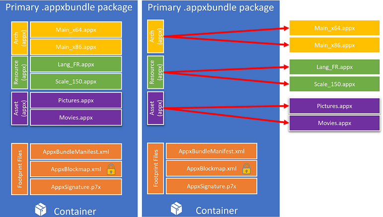

# Flat bundle app packages 

> [!IMPORTANT]
> If you intend to submit your app to the Store, you need to contact [Windows developer support](https://developer.microsoft.com/windows/support) for approval to use flat bundles.

Flat bundles are an improved way to bundle your app’s .appx package files. A typical .appxbundle file uses a multi-level packaging structure in which the .appx package files need to be contained within the bundle, flat bundles remove this need by only referencing the .appx package files, allowing them to be outside of the app bundle. Since the .appx package files are no longer contained in the bundle, they can be parallel processed, which results in reduced uploading time, faster publishing (since each .appx package file can be processed at the same time), and ultimately faster development iterations.



Another benefit of flat bundles is the need to create less packages. Since .appx package files are only referenced, two versions of the app can reference the same package file if the package did not change across the two versions. This allows you to have to create only the app packages that have changed when building the packages for the next version of your app.
By default, the flat bundles will reference .appx package files within the same folder as itself. However, this reference can be changed to other paths (relative paths, network shares, and http locations). To do this, you must directly provide a **BundleManifest** during the flat bundle creation. 

## How to create a flat bundle

A flat bundle can be created using the MakeAppx.exe tool, or by using the packaging layout to define the structure of your bundle.

### Using MakeAppx.exe
To create a flat bundle using MakeAppx.exe, use the “MakeAppx.exe bundle” command as usual but with the /fb switch to generate the flat .appxbundle file (which will be extremely small since it only references the .appx packages and does not contain any actual payloads). 

Here's an example of the command syntax:

```syntax
MakeAppx bundle [options] /d <content directory> /fb <output flat bundle name>
```

For more information on using MakeAppx.exe, see [Create an app package with the MakeAppx.exe tool](https://docs.microsoft.com/windows/uwp/packaging/create-app-package-with-makeappx-tool).

### Using packaging layout
Alternatively, you can create a flat bundle using the packing layout. To do this, set the **FlatBundle** attribute to **true** in the **PackageFamily** element of your app bundle manifest. To learn more about the packaging layout, see [Package creation with the packaging layout](packaging-layout.md).

## How to deploy a flat bundle 
Before a flat bundle can be deployed, each of the app packages (in addition to the app bundle) will need to be signed with the same certificate. This is because all of the app package files (.appx) are now independent files and are not contained within the app bundle (.appxbundle) file anymore. Once the packages are signed, use the [Add-AppxPackage cmdlet](https://docs.microsoft.com/powershell/module/appx/add-appxpackage?view=win10-ps) in PowerShell to point to the .appxbundle file and deploy the app (assuming app packages are where the app bundle expects them to be). 